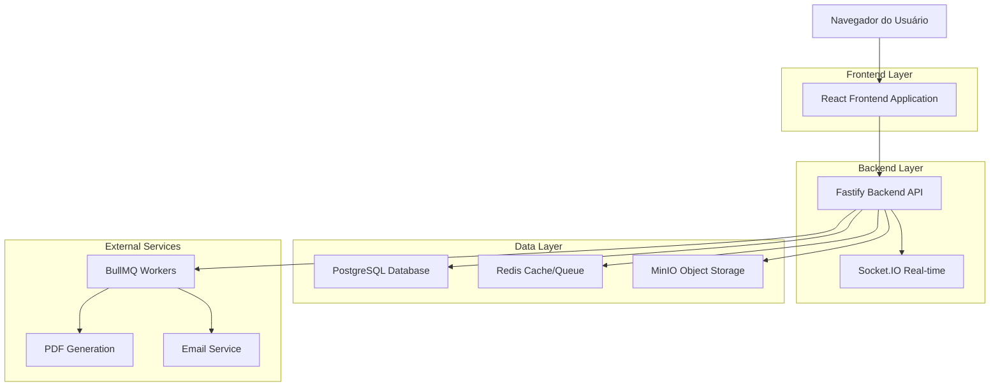
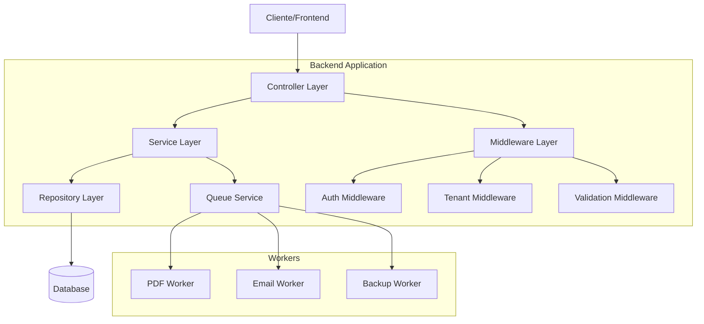
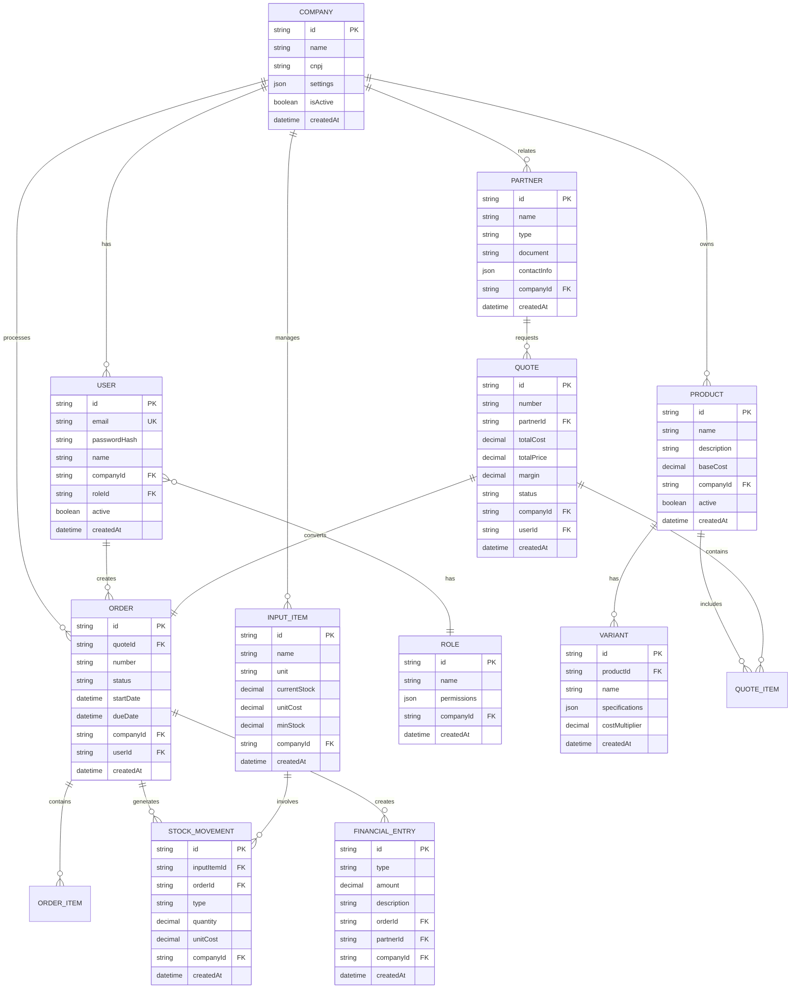

# ArtPlim ERP - Documento de Arquitetura Técnica

## 1. Arquitetura do Sistema



## 2. Stack Tecnológico

### Frontend
- React@18 + TypeScript
- Vite (build tool)
- TailwindCSS@3 (styling)
- React Query/TanStack Query (data fetching)
- React Hook Form + Zod (forms)
- React Router v6 (routing)
- Recharts (charts)
- Socket.IO Client (real-time)

### Backend
- Node.js@20 + TypeScript
- Fastify (HTTP framework)
- Prisma (ORM)
- Zod (validation)
- JWT + bcrypt (authentication)
- Socket.IO (real-time)
- BullMQ (job queue)
- Pino (logging)

### Infraestrutura
- PostgreSQL@15 (database)
- Redis@7 (cache/queue)
- MinIO (object storage)
- Docker + Docker Compose
- pnpm workspaces (monorepo)

## 3. Definição de Rotas

### Frontend Routes
| Rota | Propósito |
|------|----------|
| / | Redirect para /dashboard |
| /login | Página de autenticação |
| /dashboard | Dashboard principal com KPIs e gráficos |
| /employees | Gestão de funcionários |
| /timeclock | Controle de ponto eletrônico |
| /products | Catálogo de produtos e variantes |
| /inputs | Gestão de insumos e estoque |
| /finishes | Cadastro de acabamentos |
| /quotes | Lista e criação de orçamentos |
| /quotes/create | Wizard de criação de orçamento |
| /orders | Kanban de ordens de serviço |
| /orders/:id | Detalhes da ordem de serviço |
| /stock | Controle de estoque e movimentações |
| /finance | Fluxo de caixa e financeiro |
| /partners | Gestão de clientes e fornecedores |
| /reports | Relatórios e dashboards analíticos |
| /backups | Sistema de backup e restore |
| /settings | Configurações do sistema |

## 4. Definições da API

### 4.1 APIs Principais

#### Autenticação
```
POST /api/v1/auth/login
```

Request:
| Parâmetro | Tipo | Obrigatório | Descrição |
|-----------|------|-------------|----------|
| email | string | true | Email do usuário |
| password | string | true | Senha do usuário |

Response:
| Parâmetro | Tipo | Descrição |
|-----------|------|----------|
| accessToken | string | JWT token de acesso |
| refreshToken | string | Token para renovação |
| user | object | Dados do usuário logado |

Exemplo:
```json
{
  "email": "admin@artplim.com",
  "password": "senha123"
}
```

#### Orçamentos
```
POST /api/v1/quotes
```

Request:
| Parâmetro | Tipo | Obrigatório | Descrição |
|-----------|------|-------------|----------|
| partnerId | string | true | ID do cliente |
| items | array | true | Lista de itens do orçamento |
| margin | number | false | Margem de lucro (%) |
| discount | number | false | Desconto aplicado |

Response:
| Parâmetro | Tipo | Descrição |
|-----------|------|----------|
| id | string | ID do orçamento criado |
| number | string | Número sequencial |
| totalCost | number | Custo total calculado |
| totalPrice | number | Preço final com margem |

#### Ordens de Serviço
```
PATCH /api/v1/orders/:id/status
```

Request:
| Parâmetro | Tipo | Obrigatório | Descrição |
|-----------|------|-------------|----------|
| status | string | true | Novo status da OS |
| notes | string | false | Observações da mudança |

Response:
| Parâmetro | Tipo | Descrição |
|-----------|------|----------|
| success | boolean | Status da operação |
| order | object | Dados atualizados da OS |

#### Estoque
```
POST /api/v1/inputs/entry
```

Request:
| Parâmetro | Tipo | Obrigatório | Descrição |
|-----------|------|-------------|----------|
| inputId | string | true | ID do insumo |
| quantity | number | true | Quantidade recebida |
| purchaseCost | number | true | Custo total da compra |
| invoiceNumber | string | false | Número da nota fiscal |

Response:
| Parâmetro | Tipo | Descrição |
|-----------|------|----------|
| movementId | string | ID da movimentação |
| newUnitCost | number | Novo custo unitário calculado |
| currentStock | number | Estoque atual |

## 5. Arquitetura do Servidor



## 6. Modelo de Dados

### 6.1 Diagrama Entidade-Relacionamento



### 6.2 Schema Prisma Completo

```prisma
generator client {
  provider = "prisma-client-js"
}

datasource db {
  provider = "postgresql"
  url      = env("DATABASE_URL")
}

// Empresa (Multi-tenant)
model Company {
  id        String   @id @default(uuid())
  name      String
  cnpj      String?  @unique
  settings  Json?    @default("{}")
  isActive  Boolean  @default(true)
  createdAt DateTime @default(now())
  updatedAt DateTime @updatedAt

  // Relacionamentos
  users           User[]
  roles           Role[]
  products        Product[]
  inputItems      InputItem[]
  partners        Partner[]
  quotes          Quote[]
  orders          Order[]
  stockMovements  StockMovement[]
  financialEntries FinancialEntry[]
  employees       Employee[]
  timeclockEntries TimeclockEntry[]
  backupSnapshots BackupSnapshot[]

  @@map("companies")
}

// Usuários do sistema
model User {
  id           String   @id @default(uuid())
  email        String   @unique
  passwordHash String
  name         String
  active       Boolean  @default(true)
  lastLoginAt  DateTime?
  createdAt    DateTime @default(now())
  updatedAt    DateTime @updatedAt

  // Relacionamentos
  company   Company @relation(fields: [companyId], references: [id])
  companyId String
  role      Role    @relation(fields: [roleId], references: [id])
  roleId    String

  quotes Quote[]
  orders Order[]
  refreshTokens RefreshToken[]

  @@index([companyId])
  @@index([email])
  @@map("users")
}

// Tokens de refresh
model RefreshToken {
  id        String   @id @default(uuid())
  token     String   @unique
  expiresAt DateTime
  createdAt DateTime @default(now())

  user   User   @relation(fields: [userId], references: [id], onDelete: Cascade)
  userId String

  @@index([token])
  @@index([userId])
  @@map("refresh_tokens")
}

// Papéis e permissões
model Role {
  id          String   @id @default(uuid())
  name        String
  permissions Json     @default("{}")
  isSystem    Boolean  @default(false)
  createdAt   DateTime @default(now())
  updatedAt   DateTime @updatedAt

  company   Company? @relation(fields: [companyId], references: [id])
  companyId String?

  users User[]

  @@unique([name, companyId])
  @@index([companyId])
  @@map("roles")
}

// Funcionários
model Employee {
  id          String    @id @default(uuid())
  name        String
  document    String
  position    String?
  hourlyRate  Decimal?  @db.Decimal(10, 2)
  hireDate    DateTime?
  active      Boolean   @default(true)
  createdAt   DateTime  @default(now())
  updatedAt   DateTime  @updatedAt

  company   Company @relation(fields: [companyId], references: [id])
  companyId String

  timeclockEntries TimeclockEntry[]

  @@unique([document, companyId])
  @@index([companyId])
  @@map("employees")
}

// Registros de ponto
model TimeclockEntry {
  id        String   @id @default(uuid())
  type      String   // "in" | "out" | "break_start" | "break_end"
  timestamp DateTime
  notes     String?
  createdAt DateTime @default(now())

  employee   Employee @relation(fields: [employeeId], references: [id])
  employeeId String
  company    Company  @relation(fields: [companyId], references: [id])
  companyId  String

  @@index([employeeId, timestamp])
  @@index([companyId])
  @@map("timeclock_entries")
}

// Produtos
model Product {
  id          String   @id @default(uuid())
  name        String
  description String?
  baseCost    Decimal  @db.Decimal(10, 2)
  active      Boolean  @default(true)
  createdAt   DateTime @default(now())
  updatedAt   DateTime @updatedAt

  company   Company @relation(fields: [companyId], references: [id])
  companyId String

  variants   Variant[]
  quoteItems QuoteItem[]

  @@index([companyId])
  @@index([name])
  @@map("products")
}

// Variantes de produtos
model Variant {
  id             String  @id @default(uuid())
  name           String
  specifications Json    @default("{}")
  costMultiplier Decimal @db.Decimal(5, 4) @default(1.0000)
  active         Boolean @default(true)
  createdAt      DateTime @default(now())
  updatedAt      DateTime @updatedAt

  product   Product @relation(fields: [productId], references: [id])
  productId String

  quoteItems QuoteItem[]
  orderItems OrderItem[]

  @@index([productId])
  @@map("variants")
}

// Insumos
model InputItem {
  id           String  @id @default(uuid())
  name         String
  unit         String  // "kg", "folhas", "litros", etc.
  currentStock Decimal @db.Decimal(10, 3) @default(0)
  unitCost     Decimal @db.Decimal(10, 4) @default(0)
  minStock     Decimal @db.Decimal(10, 3) @default(0)
  active       Boolean @default(true)
  createdAt    DateTime @default(now())
  updatedAt    DateTime @updatedAt

  company   Company @relation(fields: [companyId], references: [id])
  companyId String

  stockMovements StockMovement[]

  @@index([companyId])
  @@index([name])
  @@map("input_items")
}

// Acabamentos
model Finish {
  id          String  @id @default(uuid())
  name        String
  description String?
  cost        Decimal @db.Decimal(10, 2)
  outsourced  Boolean @default(false)
  partnerId   String?
  active      Boolean @default(true)
  createdAt   DateTime @default(now())
  updatedAt   DateTime @updatedAt

  company   Company @relation(fields: [companyId], references: [id])
  companyId String
  partner   Partner? @relation(fields: [partnerId], references: [id])

  quoteItemFinishes QuoteItemFinish[]
  orderItemFinishes OrderItemFinish[]

  @@index([companyId])
  @@map("finishes")
}

// Parceiros (clientes/fornecedores)
model Partner {
  id          String   @id @default(uuid())
  name        String
  type        String   // "client" | "supplier" | "service_provider"
  document    String?
  contactInfo Json     @default("{}")
  active      Boolean  @default(true)
  createdAt   DateTime @default(now())
  updatedAt   DateTime @updatedAt

  company   Company @relation(fields: [companyId], references: [id])
  companyId String

  quotes           Quote[]
  finishes         Finish[]
  financialEntries FinancialEntry[]

  @@index([companyId])
  @@index([type])
  @@map("partners")
}

// Orçamentos
model Quote {
  id         String   @id @default(uuid())
  number     String
  totalCost  Decimal  @db.Decimal(12, 2) @default(0)
  totalPrice Decimal  @db.Decimal(12, 2) @default(0)
  margin     Decimal  @db.Decimal(5, 2) @default(0)
  discount   Decimal  @db.Decimal(5, 2) @default(0)
  status     String   @default("draft") // "draft" | "sent" | "approved" | "rejected" | "converted"
  validUntil DateTime?
  notes      String?
  createdAt  DateTime @default(now())
  updatedAt  DateTime @updatedAt

  company   Company @relation(fields: [companyId], references: [id])
  companyId String
  partner   Partner @relation(fields: [partnerId], references: [id])
  partnerId String
  user      User    @relation(fields: [userId], references: [id])
  userId    String

  items QuoteItem[]
  order Order?

  @@unique([number, companyId])
  @@index([companyId])
  @@index([status])
  @@map("quotes")
}

// Itens do orçamento
model QuoteItem {
  id          String  @id @default(uuid())
  quantity    Int
  unitCost    Decimal @db.Decimal(10, 2)
  unitPrice   Decimal @db.Decimal(10, 2)
  totalCost   Decimal @db.Decimal(12, 2)
  totalPrice  Decimal @db.Decimal(12, 2)
  description String?
  createdAt   DateTime @default(now())

  quote     Quote   @relation(fields: [quoteId], references: [id], onDelete: Cascade)
  quoteId   String
  product   Product @relation(fields: [productId], references: [id])
  productId String
  variant   Variant? @relation(fields: [variantId], references: [id])
  variantId String?

  finishes QuoteItemFinish[]

  @@index([quoteId])
  @@map("quote_items")
}

// Acabamentos dos itens do orçamento
model QuoteItemFinish {
  id        String   @id @default(uuid())
  cost      Decimal  @db.Decimal(10, 2)
  createdAt DateTime @default(now())

  quoteItem   QuoteItem @relation(fields: [quoteItemId], references: [id], onDelete: Cascade)
  quoteItemId String
  finish      Finish    @relation(fields: [finishId], references: [id])
  finishId    String

  @@index([quoteItemId])
  @@map("quote_item_finishes")
}

// Ordens de Serviço
model Order {
  id        String    @id @default(uuid())
  number    String
  status    String    @default("pending") // "pending" | "approved" | "in_production" | "finished" | "delivered" | "cancelled"
  startDate DateTime?
  dueDate   DateTime?
  notes     String?
  createdAt DateTime  @default(now())
  updatedAt DateTime  @updatedAt

  company   Company @relation(fields: [companyId], references: [id])
  companyId String
  quote     Quote   @relation(fields: [quoteId], references: [id])
  quoteId   String  @unique
  user      User    @relation(fields: [userId], references: [id])
  userId    String

  items            OrderItem[]
  stockMovements   StockMovement[]
  financialEntries FinancialEntry[]

  @@unique([number, companyId])
  @@index([companyId])
  @@index([status])
  @@map("orders")
}

// Itens da ordem de serviço
model OrderItem {
  id          String  @id @default(uuid())
  quantity    Int
  unitCost    Decimal @db.Decimal(10, 2)
  totalCost   Decimal @db.Decimal(12, 2)
  status      String  @default("pending")
  description String?
  createdAt   DateTime @default(now())
  updatedAt   DateTime @updatedAt

  order     Order   @relation(fields: [orderId], references: [id], onDelete: Cascade)
  orderId   String
  variant   Variant? @relation(fields: [variantId], references: [id])
  variantId String?

  finishes OrderItemFinish[]

  @@index([orderId])
  @@map("order_items")
}

// Acabamentos dos itens da OS
model OrderItemFinish {
  id        String   @id @default(uuid())
  cost      Decimal  @db.Decimal(10, 2)
  status    String   @default("pending")
  createdAt DateTime @default(now())
  updatedAt DateTime @updatedAt

  orderItem   OrderItem @relation(fields: [orderItemId], references: [id], onDelete: Cascade)
  orderItemId String
  finish      Finish    @relation(fields: [finishId], references: [id])
  finishId    String

  @@index([orderItemId])
  @@map("order_item_finishes")
}

// Movimentações de estoque
model StockMovement {
  id          String   @id @default(uuid())
  type        String   // "in" | "out" | "adjustment" | "loss" | "reserve"
  quantity    Decimal  @db.Decimal(10, 3)
  unitCost    Decimal  @db.Decimal(10, 4)
  totalCost   Decimal  @db.Decimal(12, 2)
  description String?
  createdAt   DateTime @default(now())

  inputItem   InputItem @relation(fields: [inputItemId], references: [id])
  inputItemId String
  company     Company   @relation(fields: [companyId], references: [id])
  companyId   String
  order       Order?    @relation(fields: [orderId], references: [id])
  orderId     String?

  @@index([inputItemId])
  @@index([companyId])
  @@index([type])
  @@index([createdAt])
  @@map("stock_movements")
}

// Lançamentos financeiros
model FinancialEntry {
  id          String   @id @default(uuid())
  type        String   // "income" | "expense" | "provision"
  amount      Decimal  @db.Decimal(12, 2)
  description String
  dueDate     DateTime?
  paidAt      DateTime?
  createdAt   DateTime @default(now())
  updatedAt   DateTime @updatedAt

  company   Company @relation(fields: [companyId], references: [id])
  companyId String
  order     Order?  @relation(fields: [orderId], references: [id])
  orderId   String?
  partner   Partner? @relation(fields: [partnerId], references: [id])
  partnerId String?

  @@index([companyId])
  @@index([type])
  @@index([dueDate])
  @@map("financial_entries")
}

// Snapshots de backup
model BackupSnapshot {
  id          String   @id @default(uuid())
  filename    String
  size        BigInt
  checksum    String
  description String?
  createdAt   DateTime @default(now())

  company   Company @relation(fields: [companyId], references: [id])
  companyId String

  @@index([companyId])
  @@index([createdAt])
  @@map("backup_snapshots")
}
```

### 6.3 Comandos DDL e Dados Iniciais

```sql
-- Criar índices adicionais para performance
CREATE INDEX CONCURRENTLY idx_users_company_active ON users(company_id, active);
CREATE INDEX CONCURRENTLY idx_orders_company_status ON orders(company_id, status);
CREATE INDEX CONCURRENTLY idx_stock_movements_date ON stock_movements(created_at DESC);
CREATE INDEX CONCURRENTLY idx_financial_entries_due_date ON financial_entries(due_date) WHERE paid_at IS NULL;

-- Dados iniciais - Roles do sistema
INSERT INTO roles (id, name, permissions, is_system, created_at) VALUES
('sys-super-admin', 'Super Admin', '{"*": ["*"]}', true, NOW()),
('sys-admin', 'Administrador', '{"users": ["create", "read", "update", "delete"], "products": ["*"], "orders": ["*"], "reports": ["*"]}', true, NOW()),
('sys-manager', 'Gerente', '{"orders": ["read", "update", "approve"], "reports": ["read"], "quotes": ["*"]}', true, NOW()),
('sys-operator', 'Operador', '{"orders": ["read", "update"], "quotes": ["create", "read", "update"], "stock": ["read", "update"]}', true, NOW()),
('sys-employee', 'Funcionário', '{"timeclock": ["create", "read"]}', true, NOW());

-- Dados de exemplo - Insumos
INSERT INTO input_items (id, name, unit, current_stock, unit_cost, min_stock, company_id, created_at) VALUES
('input-papel-a4', 'Papel A4 75g', 'folhas', 8000, 0.05, 1000, 'company-demo', NOW()),
('input-tinta-preta', 'Tinta Preta Offset', 'kg', 50, 25.00, 10, 'company-demo', NOW()),
('input-verniz', 'Verniz UV', 'litros', 20, 45.00, 5, 'company-demo', NOW());

-- Dados de exemplo - Produtos
INSERT INTO products (id, name, description, base_cost, company_id, created_at) VALUES
('prod-cartao-visita', 'Cartão de Visita', 'Cartão de visita padrão 9x5cm', 0.15, 'company-demo', NOW()),
('prod-flyer', 'Flyer', 'Flyer promocional A5', 0.25, 'company-demo', NOW()),
('prod-folder', 'Folder', 'Folder institucional A4', 1.50, 'company-demo', NOW());

-- Dados de exemplo - Acabamentos
INSERT INTO finishes (id, name, description, cost, outsourced, company_id, created_at) VALUES
('finish-laminacao', 'Laminação Fosca', 'Laminação fosca BOPP', 0.80, false, 'company-demo', NOW()),
('finish-verniz-uv', 'Verniz UV Localizado', 'Verniz UV em área específica', 1.20, true, 'company-demo', NOW()),
('finish-corte-especial', 'Corte Especial', 'Corte em formato diferenciado', 2.00, true, 'company-demo', NOW());
```