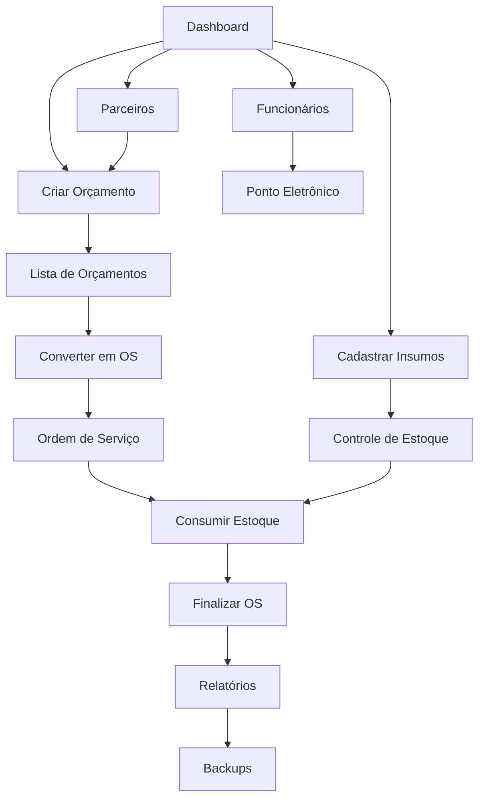

# ArtPlim ERP - Documento de Requisitos Funcionais

## 1. Visão Geral do Produto

O ArtPlim ERP é um sistema de gestão empresarial completo desenvolvido especificamente para gráficas, oferecendo controle integrado de produção, estoque, financeiro e recursos humanos. O sistema resolve os principais desafios do setor gráfico: gestão de insumos com cálculo preciso de custos, controle de ordens de serviço com etapas de produção, acabamentos terceirizados e relatórios de lucratividade detalhados.

O produto atende gráficas de pequeno e médio porte que necessitam de um sistema robusto para otimizar processos produtivos, reduzir desperdícios e aumentar a margem de lucro através de controle rigoroso de custos e prazos.

## 2. Funcionalidades Principais

### 2.1 Papéis de Usuário

| Papel | Método de Registro | Permissões Principais |
|-------|-------------------|----------------------|
| Super Admin | Criação manual do sistema | Gerenciar empresas, configurações globais |
| Administrador | Convite por Super Admin | Gerenciar usuários, configurar sistema, acessar todos os módulos |
| Gerente | Criação por Administrador | Aprovar orçamentos, visualizar relatórios financeiros, gerenciar funcionários |
| Operador | Criação por Admin/Gerente | Criar orçamentos, registrar OS, controlar estoque |
| Funcionário | Criação por Admin/Gerente | Registrar ponto, visualizar próprias informações |

### 2.2 Módulos Funcionais

O sistema ArtPlim ERP é composto pelos seguintes módulos principais:

1. **Dashboard**: painel principal com indicadores, gráficos de performance e notificações em tempo real
2. **Autenticação e Usuários**: login seguro, gestão de usuários e controle de acesso baseado em papéis
3. **Funcionários e Ponto**: cadastro de funcionários, registro de ponto eletrônico e relatórios de frequência
4. **Produtos e Variantes**: catálogo de produtos gráficos com variações de tamanho, papel e acabamento
5. **Insumos**: controle de estoque de materiais com cálculo automático de custo unitário
6. **Acabamentos**: gestão de processos de finalização internos e terceirizados
7. **Orçamentos**: criação de propostas comerciais com cálculo detalhado de custos e margens
8. **Ordens de Serviço**: controle de produção com etapas, consumo de materiais e timeline
9. **Estoque**: movimentações, ajustes, alertas de estoque mínimo e relatórios
10. **Financeiro**: fluxo de caixa, contas a pagar/receber, provisões e centro de custos
11. **Parceiros**: cadastro de clientes, fornecedores e prestadores de serviços
12. **Relatórios**: dashboards analíticos de lucratividade, performance e indicadores
13. **Backups**: sistema automatizado de backup e restore com versionamento
14. **Notificações**: alertas em tempo real via Socket.IO e sistema de mensagens

### 2.3 Detalhamento das Páginas

| Página | Módulo | Descrição da Funcionalidade |
|--------|--------|-----------------------------|
| Dashboard | Painel Principal | Exibir KPIs, gráficos de vendas, OS em andamento, alertas de estoque, notificações em tempo real |
| Login/Registro | Autenticação | Autenticar usuários, recuperar senha, primeiro acesso com definição de senha |
| Usuários | Gestão de Usuários | CRUD de usuários, atribuir papéis, ativar/desativar contas, histórico de acessos |
| Funcionários | Recursos Humanos | Cadastrar funcionários, definir cargos, configurar horários, visualizar dados pessoais |
| Ponto Eletrônico | Controle de Ponto | Registrar entrada/saída, justificar ausências, gerar relatórios de frequência por período |
| Produtos | Catálogo | CRUD de produtos gráficos, definir especificações técnicas, calcular custos base |
| Variantes | Produtos | Criar variações de produtos (tamanhos, papéis, cores), definir preços específicos |
| Insumos | Estoque | Cadastrar materiais, registrar entradas com nota fiscal, calcular custo unitário automático |
| Controle de Estoque | Estoque | Visualizar saldos, movimentações, alertas de estoque mínimo, ajustes manuais |
| Acabamentos | Produção | CRUD de processos de acabamento, definir custos, marcar como terceirizado/interno |
| Criar Orçamento | Vendas | Wizard multi-etapas: dados cliente, itens, acabamentos, margens, geração de PDF |
| Lista de Orçamentos | Vendas | Visualizar propostas, filtrar por status, converter em OS, reenviar por email |
| Ordens de Serviço | Produção | Kanban de OS, timeline de etapas, consumo de materiais, anexar arquivos |
| Detalhes da OS | Produção | Acompanhar progresso, registrar tempos, consumir estoque, anexar provas/artes |
| Fluxo de Caixa | Financeiro | Visualizar entradas/saídas, projeções, gráficos de cashflow, filtros por período |
| Contas a Pagar | Financeiro | Gerenciar fornecedores, provisões de acabamentos, vencimentos, pagamentos |
| Parceiros | CRM | CRUD de clientes/fornecedores, histórico de transações, dados de contato |
| Relatórios | Analytics | Dashboards de lucratividade, performance de produtos, análise de custos |
| Backups | Sistema | Criar snapshots, agendar backups automáticos, restaurar versões anteriores |
| Configurações | Sistema | Definir temas, moeda, configurações fiscais, permissões, integrações |

## 3. Fluxos Principais do Sistema

### Fluxo do Administrador
O administrador configura o sistema, cadastra usuários e define permissões. Gerencia produtos, insumos e acabamentos. Configura políticas de backup e monitora a saúde do sistema através de relatórios e dashboards.

### Fluxo do Operador Comercial
O operador recebe solicitações de orçamento, cadastra dados do cliente, seleciona produtos e variantes, define acabamentos e calcula margens. Gera PDF da proposta e acompanha aprovações. Converte orçamentos aprovados em ordens de serviço.

### Fluxo do Operador de Produção
O operador de produção recebe OS aprovadas, reserva materiais necessários, acompanha etapas de produção, registra consumo real de insumos, gerencia perdas e finaliza ordens. Atualiza status em tempo real via sistema.

### Fluxo do Gerente
O gerente aprova orçamentos acima de determinado valor, monitora indicadores de performance, analisa relatórios de lucratividade, gerencia equipe e toma decisões estratégicas baseadas em dados do sistema.

## 4. Design da Interface do Usuário

### 4.1 Estilo de Design

- **Cores Primárias**: Azul corporativo (#2563EB), Verde sucesso (#10B981)
- **Cores Secundárias**: Cinza neutro (#6B7280), Laranja alerta (#F59E0B), Vermelho erro (#EF4444)
- **Estilo de Botões**: Arredondados com sombra sutil, estados hover e focus bem definidos
- **Tipografia**: Inter como fonte principal, tamanhos 14px (corpo), 16px (títulos), 12px (legendas)
- **Layout**: Design baseado em cards com sidebar fixa, topbar com breadcrumbs e notificações
- **Ícones**: Heroicons para consistência, com suporte a ícones personalizados para gráfica

### 4.2 Visão Geral das Páginas

| Página | Módulo | Elementos de UI |
|--------|--------|----------------|
| Dashboard | Painel Principal | Cards de KPIs com ícones coloridos, gráficos interativos (Recharts), lista de OS recentes, sidebar com menu expansível |
| Login | Autenticação | Formulário centralizado, logo da empresa, campos com validação visual, botão de recuperar senha |
| Orçamentos | Vendas | Wizard com steps indicator, formulários multi-seção, tabela de itens editável, preview de PDF |
| OS Kanban | Produção | Colunas drag-and-drop, cards coloridos por prioridade, modal de detalhes, timeline visual |
| Estoque | Inventário | Tabela com filtros avançados, badges de status, gráficos de movimentação, alertas visuais |
| Relatórios | Analytics | Dashboards com filtros de período, gráficos responsivos, exportação para PDF/Excel |

### 4.3 Responsividade

O sistema é desenvolvido com abordagem mobile-first, adaptando-se automaticamente a tablets e desktops. A sidebar colapsa em menu hambúrguer em telas menores. Tabelas tornam-se scrolláveis horizontalmente. Formulários reorganizam campos em layout vertical. Touch interactions são otimizadas para dispositivos móveis.